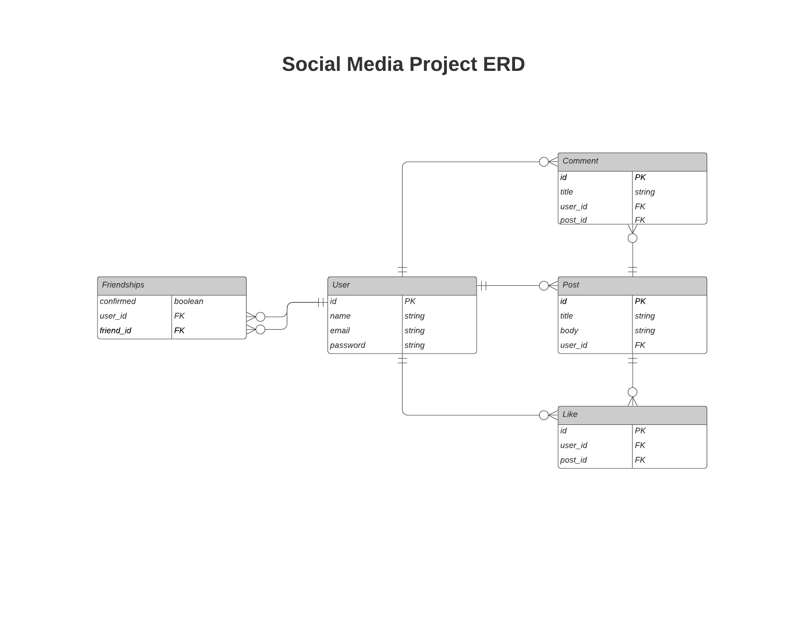

# Microverse's Rails Social Media Project

[![Contributors][contributors-shield]][contributors-url]
[![Forks][forks-shield]][forks-url]
[![Stargazers][stars-shield]][stars-url]
[![Issues][issues-shield]][issues-url]

## About the project

This project consists of bulding the "frienship" functionality on top of an existing repo.

## Data Model

## Requirements

- Once you download the project, please make sure that you have [Ruby](https://www.ruby-lang.org/en/) installed.
- Install `rails 5.2.3` if you haven't already. You could run the command `gem install rails -v '5.2.3'` to install rails.
- Make sure to run `bundle` command in the terminal once you are in the working directory.

## Features

Some of the features of this project include:

- Create a complete project's ERD
- Add relations between the following models:
    - User <-> Friendship
    - User <-> Posts
    - User <-> Comments
    - User <-> Likes
    - Likes <-> Posts <-> Comments
- Create Friendship model and its association with the User model
- Create helper methods for the User model:
    - Friends
    - Pending Friends
    - Friend Requests
    - Confirm Friend
    - Friend?
- Created appropriate tests for the model and for the view
- Create a "mutual" method inside of the Friendships class to check mutual friends
- Write the test for the mutual method
- Write a test for the user#index view

## Technologies Used

- This project utilizes the Rails framework.

<!-- 

## Testing

## Test Output

-->

## Contributors

- Alvaro Paz
  - Linkedin: [@alvaropaz](https://linkedin.com/in/alvaropaz/)
  - GitHub: [@alvaropazz](https://github.com/alvaropazz)
  - Twitter: [@alvaroipazr](https://twitter.com/alvaroipazr)

- Moin Khan
  - LinkedIn : [@MoinKhanIF](https://www.linkedin.com/in/moinkhanif/)
  - Personal Website: [MoinKhan.Info](https://moinkhan.info)
  - Twitter: [@MoinKhanIF](https://twitter.com/MoinKhanIF)
  
<!-- MARKDOWN LINKS & IMAGES -->

[contributors-shield]: https://img.shields.io/github/contributors/alvaropazz/ror-social-scaffold.svg?style=flat-square
[contributors-url]: https://github.com/alvaropazz/ror-social-scaffold/graphs/contributors
[forks-shield]: https://img.shields.io/github/forks/alvaropazz/ror-social-scaffold.svg?style=flat-square
[forks-url]: https://github.com/alvaropazz/ror-social-scaffold/network/members
[stars-shield]: https://img.shields.io/github/stars/alvaropazz/ror-social-scaffold.svg?style=flat-square
[stars-url]: https://github.com/alvaropazz/ror-social-scaffold/stargazers
[issues-shield]: https://img.shields.io/github/issues/alvaropazz/ror-social-scaffold.svg?style=flat-square
[issues-url]: https://github.com/alvaropazz/ror-social-scaffold/issues

